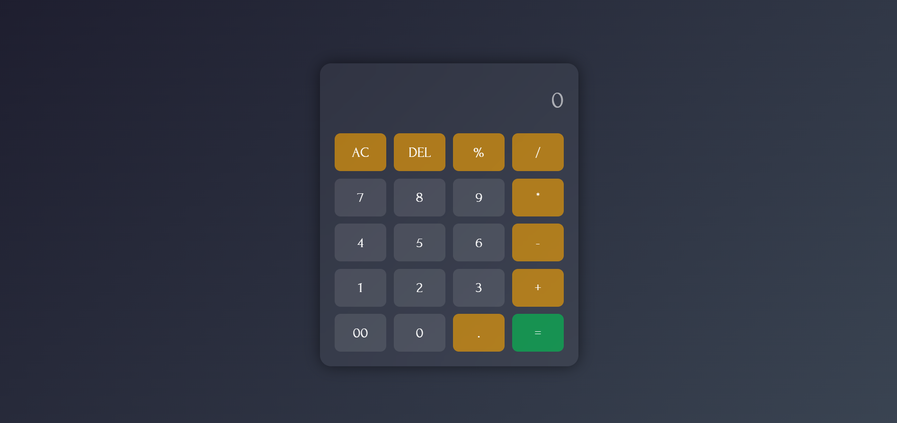

# 🧮 Calculator

A simple, stylish, and responsive **web calculator** built using **HTML**, **CSS**, and **JavaScript**.  
It supports basic arithmetic operations with a modern UI.

## 🚀 Live Demo
[Click here to try it!](https://mangesh-surwase.github.io/Calculator/)

## 📸 Preview

## ✨ Features
- Minimal and modern UI
- Responsive design
- Basic operations: Addition, Subtraction, Multiplication, Division, Percentage
- AC (All Clear) and DEL (Delete) functionality
- Equal (`=`) button for quick results

## 🛠️ Technologies Used
- HTML5
- CSS3
- JavaScript (Vanilla)

## 📂 Project Structure
